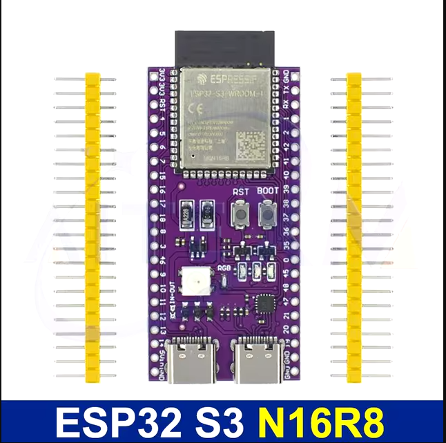

## info
* **ESP32-S3-DevKitC-1-N16R8.json** - this is board description file for ESP32-S3-WROOM-1-N16R8 16 MB (Quad SPI) 8 MB (Octal SPI) [documentation](https://www.espressif.com/sites/default/files/documentation/esp32-s3-wroom-1_wroom-1u_datasheet_en.pdf)
* **default_16MB.csv**  this is basic partition file with minimum 3.5Mb spiffs file system



## Other
* You can find other partition files [this](https://github.com/espressif/arduino-esp32/tree/master/tools/partitions)
* And other board description files [this](https://github.com/Jason2866/platform-espressif32/tree/Arduino/IDF5/boards)

# Instrustions
1) move all this files to ***{ProjectPath} / boards ***
2) edit **platformio.ini** file:

```cpp
; Flash: 16MB QD, PSRAM: 8MB OT
[env:ESP32-S3-DevKitC-1-N16R8]
platform = espressif32
board = ESP32-S3-DevKitC-1-N16R8 ; 16 MB Flash, 8MB octo PSRAM
framework = arduino


monitor_speed = 115200
```
# Test code

```cpp
#include "Arduino.h"

#define BOOTLOG( ... ) { char buf[120]; sprintf( buf, __VA_ARGS__ ) ; Serial.print("##[BOOT]#\t"); Serial.println(buf); }

void setup() {
  Serial.begin(115200);
}

void loop() {

  BOOTLOG("Total heap: %d", ESP.getHeapSize());
  BOOTLOG("Free heap: %d", ESP.getFreeHeap());
  BOOTLOG("Total PSRAM: %d", ESP.getPsramSize());
  BOOTLOG("Free PSRAM: %d", ESP.getFreePsram());
  delay(1000);
}
```

# Monitor

```
RAM:   [=         ]  14.6% (used 47780 bytes from 327680 bytes)
Flash: [=         ]  11.0% (used 720281 bytes from 6553600 bytes)

##[BOOT]#       Total heap: 365636  
##[BOOT]#       Free heap: 304228   
##[BOOT]#       Total PSRAM: 8386231
##[BOOT]#       Free PSRAM: 8385851 
```

Działa!!!!
